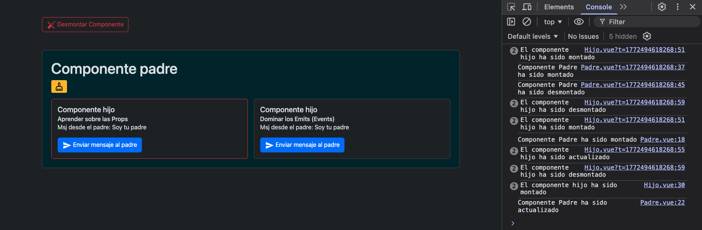

# m7l1d4-componentes-practica

En este ejercicio se ponen en práctica el uso de Props y Eventos (Emits) para manejar la comunicación entre componentes padres e hijos.
También se observa, a través de `console.log`, el comportamieto de 3 distintos Hooks del ciclo de vida de los componentes en Vue.

## Cómo ejecutar el proyecto

### Instalar dependencias

```sh
pnpm install
```

### Compilar y ver cambios en tiempo real

```sh
pnpm dev
```

## Captura de pantalla mostrando los Hooks del ciclo de vida


